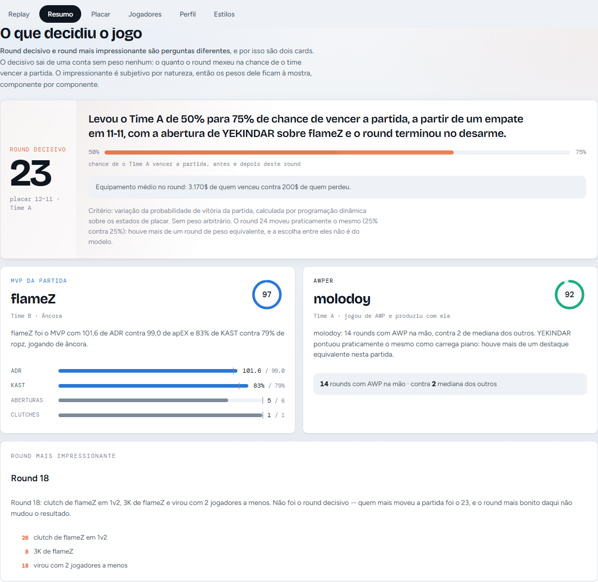
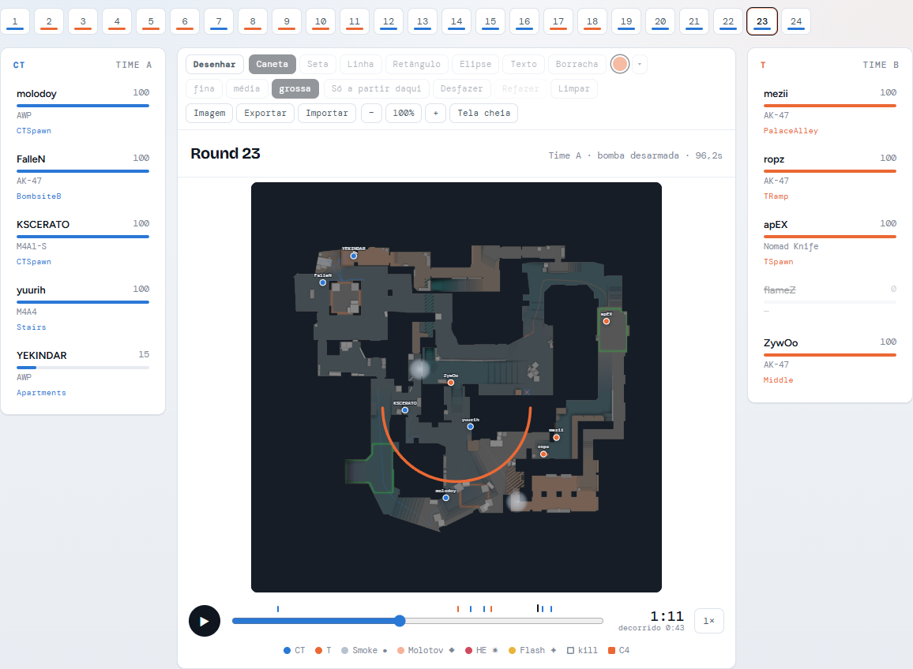
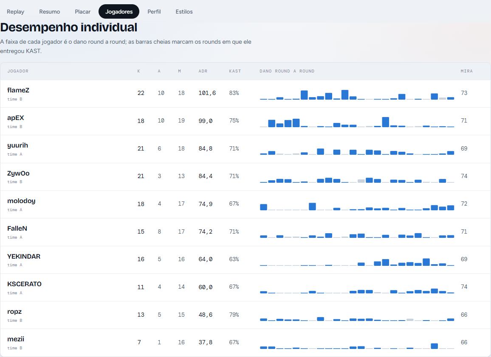
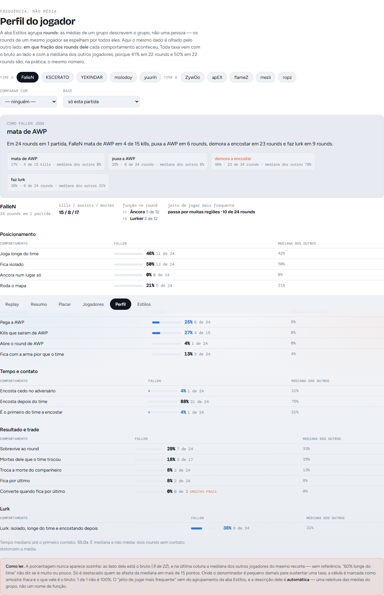

# Parser de Replay CS2 — métricas com decisão de jogo

**[→ Demonstração ao vivo](https://pedroppansani.github.io/parser-replay-cs2/)** —
52 partidas (43 profissionais de NAVI, Spirit, Vitality, FURIA, Falcons, MOUZ e
The MongolZ, e 9 de FACEIT), com replay round a round no radar, leitura da
partida e perfil de cada jogador.

Lê replays `.dem` do Counter-Strike 2, extrai as estatísticas e gera um site
estático por partida. Projeto 1 de 5 de um portfólio.



## O que é, e qual o diferencial

O parsing não é o diferencial: a biblioteca [awpy](https://awpy.rtfd.io/) (sobre
o parser Rust `demoparser2`) já resolve isso. **O diferencial é o desenho das
métricas: cada uma carrega uma decisão de jogo explícita no código**, escrita e
testada — e várias foram corrigidas justamente porque a versão ingênua
contradizia o que acontece numa partida de verdade. Alguns exemplos:

- **Round decisivo** sai da variação da probabilidade de vencer a partida
  (programação dinâmica sobre o placar), não de uma soma de pontos inventados.
  Numa partida 13-3, nenhum round decidiu nada — e a página diz isso.
- **Crosshair placement** só é cobrado nos instantes que antecedem um contato
  real; medir a distância até o inimigo mais próximo pune quem pré-mira certo.
- **Função do jogador** (âncora, rotativo, entry, lurker, AWPer...) e **traço de
  comportamento** (carrega piano, baiter, carry, mochila...) são camadas
  separadas: um âncora pode ser carrega piano ou baiter.
- **Toda taxa vem com o bruto e com referência**: "41% (9 de 22), mediana dos
  outros 30%" — com 22 rounds, 41% e 50% são o mesmo número.
- **O rating é uma implementação própria da metodologia publicada do Rating 3.0
  da HLTV**, não o número oficial (os coeficientes da HLTV são fechados). Ele é
  validado contra os ratings oficiais de 41 mapas profissionais.

Quem define o que cada métrica deve medir é conhecimento de jogo (Faceit Level
10 / Level 20 GC, flex AWPer); os limiares são constantes nomeadas, com o
porquê ao lado, e os pontos que dependem de julgamento humano estão listados
em vez de escondidos.



## Como rodar

**Python 3.11 a 3.13** (o awpy 2.0.2 não suporta 3.14). No Windows: `py -3.12`.

```bash
pip install -r requirements.txt

# radares oficiais, extraídos da instalação local do CS2 (uma vez só)
python -m scripts.extract_radars

# processar todas as demos da pasta demos/ (parse, métricas, replay, página)
python -m scripts.process_all_demos

# site de demonstração com todas as partidas processadas -> docs/index.html
python -m scripts.build_site

# testes (os de navegador usam o Chrome instalado via Playwright; sem ele, são pulados)
python -m pytest tests/ -v
```

Outros comandos:

```bash
# uma demo só, ou reaproveitando um parse anterior (pula os ~14s de parsing)
python -m scripts.process_demo demos/partida.dem --match-id match_60 [--from-interim]

# manifesto das partidas (times, evento, hash da demo) -> data/manifest.json
python -m scripts.manifest

# apagar demo e dados crus de uma partida, só se o processado estiver íntegro
python -m scripts.clean_match match_43              # confere e simula
python -m scripts.clean_match match_43 --confirmar  # apaga e registra no manifesto

# rating: referência de escala, e regressão contra os ratings oficiais
python -m scripts.fit_rating [--fit-pesos]

# dashboard de trabalho (Streamlit)
streamlit run dashboard/app.py
```

As demos (200–500MB cada) ficam em `demos/` e **não vão para o git**; os dados
crus do parse ficam em `data/interim/` (também fora). O que é versionado é
`data/processed/` — leve, e é o que o site consome — e o `data/manifest.json`,
que registra de onde veio cada partida mesmo depois de a demo ser apagada.

## Validação do rating contra a HLTV

O rating daqui é uma **implementação própria da metodologia publicada do
[Rating 3.0 da HLTV](https://www.hltv.org/news/41283/introducing-rating-30)** —
os coeficientes da HLTV são fechados, então este não é o número oficial. Ele é
conferido contra os ratings oficiais de **43 mapas profissionais (430
jogadores)**, com a regressão validada **deixando uma partida inteira de fora**
a cada vez (nunca o mesmo jogo dos dois lados da divisão).

| Etapa | Erro médio (fora da amostra) | Correlação |
|---|---|---|
| Pesos provisórios, componentes originais | 0,155 | 0,891 |
| Pesos ajustados | 0,111 | 0,921 |
| + cegueira reconstruída nas demos de campeonato | 0,111 | 0,921 |
| + economia estimada no corpus (arma + colete) | 0,094* | 0,949* |
| **+ Round Swing corrigido (crédito soma zero, fim de round)** | **0,085** | **0,956** |

\* medido com os pesos congelados, antes de recalibrar.

A maior parte do ganho veio de **consertar componentes**, não de ajustar pesos:
com os componentes corrigidos, até os pesos antigos dão erro 0,086. Cada
componente também é conferido direto contra o que a HLTV publica por jogador,
de baixo para cima — contagem errada embaixo faria qualquer acerto em cima ser
coincidência (`py -3.12 -m scripts.escada_validacao`):

- **rounds, kills e mortes**: idênticos em 41 de 41 mapas e 410 de 410
  jogadores (travado em teste);
- **ADR**: idêntico no arredondamento em 401 de 410; os 9 restantes ficam a no
  máximo 0,76 abaixo. Chegar aqui exigiu corrigir o dano do awpy quando há
  vários acertos no mesmo tick (balins de escopeta contavam 158 de dano numa
  vítima de 100 de vida);
- **KAST**: idêntico em 230 de 310 jogadores; o excesso restante está em rounds
  creditados só por trade, e a regra exata da HLTV não é recuperável dos dados;
- **Round Swing**: correlação 0,89 com o Swing oficial de 310 jogadores, na
  mesma escala (inclinação 1,01). O Swing oficial **soma zero** em cada mapa
  (28 de 31; as três exceções são exatamente os mapas com fogo amigo ou queda
  no meio do round) — uma propriedade que a HLTV não publicou e que vira
  restrição do modelo daqui.

Erro de teste por time (o corpus é quase todo de 7 times; se o modelo tivesse
aprendido o estilo de um deles, aquele time destoaria):

| Time | Jogador-partidas | Erro médio |
|---|---|---|
| Vitality | 85 | 0,093 |
| FURIA | 80 | 0,079 |
| Natus Vincere | 70 | 0,080 |
| Spirit | 60 | 0,092 |
| Falcons | 60 | 0,078 |
| MOUZ | 50 | 0,081 |

## Módulos

| Pasta | O que faz |
|---|---|
| `parsing/` | Wrapper do awpy: parse, persistência em parquet, e a limpeza que vale para todo leitor (mortes do freeze time e do intervalo, round de faca, demo dividida pelo GOTV) |
| `metrics/` | As métricas. Básicas (ADR, KAST, trades), AWP, crosshair, posicionamento, áreas do mapa, granadas e arremessos, clutch, funções estruturais (`structural_roles`), traços de comportamento (`archetypes`), perfil por jogador, probabilidade de vitória, round decisivo e impressionante, destaques, rating, regra de lados |
| `clustering/` | Estilo de jogo por (jogador, round): PCA + KMeans ajustado uma vez no conjunto das partidas |
| `scripts/` | Pipeline (processar, insights, replay, página, site), calibração (rating, escala dos papéis, clusters, ângulos, áreas), manifesto e limpeza |
| `dashboard/` | Streamlit de trabalho e o template da página web; `dashboard/web/annotations.*` é a camada de desenho, zoom e tela cheia |
| `data/processed/` | Métricas calculadas por partida (versionado) |
| `data/reference/` | Ratings oficiais da HLTV usados na validação do rating |
| `tests/` | ~700 testes, incluindo testes de navegador da camada de desenho |



## Limitações conhecidas

- **Corpus pequeno e concentrado:** 52 partidas, quase todas de 7 times. O modelo
  do Round Swing (AUC 0,90) e a calibração do rating melhoram a cada demo.
- **Rating:** reimplementação da metodologia, não o número da HLTV (erro médio
  0,085 contra o oficial, fora da amostra). O modelo de chance de vitória do
  Round Swing usa 4 entradas; o da HLTV é mais rico (tempo restante, mapa), e
  a divergência de Swing que sobra é espalhada, não concentrada.
- **Estilo de jogo é contínuo:** a silhueta do agrupamento é baixa (~0,2) e não
  melhorou com volume; os grupos descrevem, não classificam com fronteira nítida.
- **Probabilidade de vitória** supõe rounds independentes (economia e momentum
  violam isso) e trata a prorrogação como 50/50.
- **A Nuke** (dois andares) tem a partição de áreas menos revisada.
- **Comando de console dos arremessos** (`setpos`/`setang`) ainda não foi validado
  dentro do jogo; até lá, não é apresentado como exato.
- **A demo não guarda a data da partida**; o manifesto registra a data do arquivo
  e diz de onde ela veio.
- Depois de `clean_match` sem `--manter-interim`, a partida continua no site mas
  não pode mais ser recalculada sem baixar a demo de novo.



---

# Registro técnico: decisões e bugs encontrados

O que segue é o histórico de como cada métrica chegou onde está, com as
versões que foram testadas e descartadas. As decisões que não devem ser
desfeitas sem discussão estão resumidas em `CLAUDE.md`.

## Por que esse projeto

Sou jogador de CS2 de nível alto (Faceit Level 10 / Level 20 GC, flex AWPer) e
estudante de Engenharia de Computação com ênfase em IA. O parsing em si não é o
diferencial — a biblioteca [awpy](https://awpy.rtfd.io/) (que usa o parser Rust
`demoparser2`) já resolve isso. O diferencial é o desenho das métricas: cada uma
carrega uma decisão de jogo explícita no código, e várias delas foram corrigidas
justamente porque a versão ingênua contradizia o que acontece na prática.

## Arquitetura

```
.dem → awpy.Demo.parse() → tabelas brutas (rounds, kills, damages, shots,
                           grenades, player_blind, detonações, ticks)
     → metrics/  (Fases 1, 2 e 4) → métricas por jogador/round
     → clustering/ (Fase 3)       → PCA + KMeans sobre essas métricas
     → parquet em data/processed/ → dashboard (Streamlit + Plotly)
                                  → página web autocontida (sem servidor)
```

```
parsing/      wrapper do awpy.Demo (parse + persistência em parquet)
metrics/      geometry, basic_metrics, awp_metrics, crosshair, map_angles,
              positioning, grenades, map_areas, site_roles, clutch, formatting,
              archetypes      — papéis comportamentais (como ele joga)
              structural_roles — função no round (o que ele faz), por lado
              player_profile   — frequência de cada comportamento, por jogador
              win_probability  — chance de vencer a partida, round a round
              round_spectacle  — o round mais impressionante
              match_highlights — MVP e o outro destaque da partida
              grenade_throws   — ficha de execução de cada arremesso
clustering/   playstyle (PCA + KMeans), global_model.json e cluster_names.json
dashboard/    app Streamlit, tokens visuais e web/ (painel de portfólio)
scripts/      CLI de processamento, ajuste do clustering global, calibração de
              ângulos, narrativa dos cards e build da página web
tests/        275 testes (dados sintéticos + validação contra as demos reais)
demos/        .dem baixados do FACEIT (gitignored)
data/raw/     .dem originais (gitignored)
data/interim/ tabelas brutas em parquet (gitignored — ticks passa de 1M de linhas)
data/processed/ métricas calculadas (vai pro repositório e alimenta o dashboard)
data/global_clusters/ clustering ajustado no conjunto das 9 partidas
```

---

## Fase 1 — métricas básicas

- **ADR**: dano a inimigos por round, usando `dmg_health_real` (dano travado no
  HP restante da vítima, sem overkill). Fogo amigo não conta.
- **KAST%**: rounds com Kill, Assist, Survived ou Traded.
- **Trade kills**: kills que vingaram um companheiro dentro de 5s.
- **Utility damage**: dano de granada (HE + fogo), sem bomba e sem fogo amigo.

---

## Fase 2 — métricas autorais

Aqui está o conteúdo do projeto. Cada métrica abaixo tem a justificativa de jogo
comentada no código, e três delas foram reescritas depois que os dados reais
mostraram que a primeira versão estava medindo a coisa errada.

### Geometria de mira — validada, não assumida

Crosshair placement depende de converter pitch/yaw em direção. Errar a convenção
do Source (pitch **positivo é olhar pra baixo**) inverteria toda a análise sem
dar erro nenhum. Em vez de confiar na documentação, a convenção é validada
contra os dados: **no tick de cada kill, a mira do atacante tem que estar
apontando pra vítima**.

| Convenção | Erro angular mediano no tick da kill | Kills com mira a menos de 5° |
|---|---|---|
| Adotada (pitch+ = baixo) | **1,76°** | **77,6%** |
| Invertida (controle) | 6,52° | 37,2% |

Isso roda como teste automatizado (`tests/test_geometry.py`), com a convenção
invertida junto como controle — se um dia o teste passar nas duas, ele não está
medindo nada.

### Uso de AWP

- **Conversão da briga**: das primeiras brigas de AWP do round, quantas foram
  ganhas. Tiro que errou mas não custou a vida entra numa categoria à parte
  (`no_trade`), fora do denominador: com AWP, muito tiro é de informação ou pra
  negar espaço, e contar isso como derrota infla a taxa de erro do AWPer.
- **Tempo até o primeiro contato**: AWP que busca pick aos 6s joga um papel
  diferente de AWP que aparece aos 40s.
- **Peek vs hold**: classificado pelo deslocamento líquido nos 3s antes do tiro.
  Usa deslocamento **líquido** e não distância percorrida de propósito — quem
  faz jiggle peek e volta pro mesmo lugar está jogando um ângulo, não avançando
  espaço (há teste travando essa decisão). **Peek e hold não são certo e errado**;
  a métrica reporta a distribuição, não dá nota.

**Achado de qualidade de dado:** a flag `is_scoped` do demo não é confiável. 40%
dos ticks marcados como "scopado" aparecem com velocidade acima de 150 u/s, o
que é impossível — AWP scopada anda a ~58 u/s (mediana medida) contra ~208 u/s
sem scope. A propriedade aparentemente fica presa no último valor entre
atualizações. Por isso a classificação usa **posição medida**, não a flag; a
`scoped_fraction` fica no output só como sinal secundário.

### Crosshair placement

O spec do projeto era explícito: **não** medir só distância angular até o inimigo
mais próximo, porque isso pune exatamente o comportamento certo — pré-mirar o
ângulo por onde o inimigo vai aparecer, antes dele aparecer. O score tem três
componentes:

1. **Altura da mira** (sempre vale): quanto a mira está fora da linha da cabeça.
   Sem a malha de navegação do mapa (o download dos assets do awpy exige rede
   liberada), o "nível correto" de cada região é estimado pela **mediana do pitch
   dos atacantes nas kills daquela região** — isso absorve a inclinação real do
   terreno (rampa, degrau) sem precisar da geometria do mapa.
2. **Direção na entrada da briga**: erro angular até o inimigo, mas **só** nas
   amostras que antecedem um contato real do jogador (tiro ou dano dentro de 1s).
   Sem esse filtro, o erro mediano até "o inimigo mais próximo" fica em 36-117°
   mesmo entre profissionais, porque na maior parte do tempo esse inimigo está
   atrás de uma parede. Com o filtro, cai pra 14-24° — que descreve briga de
   verdade.
3. **Crédito de pré-fire**: sem inimigo em alcance, a mira alinhada a um ângulo
   de entrada conhecido da região conta como **acerto**, não como "mira sem alvo".

Os ângulos de entrada são **derivados dos dados** (as direções em que as kills
daquela região de fato aconteceram), não constantes que eu inventei: um ângulo
chutado errado é pior que nenhum, porque premia placement ruim em silêncio. Há
hook de override manual (`MANUAL_ENTRY_ANGLES`) pro meu conhecimento de mapa ter
prioridade — é o principal ponto de calibração do projeto.

### Posicionamento

Heatmaps de presença por lado, e desvio de setup por round. O desvio compara
cada round com o **padrão do próprio time naquela partida**, não com um "setup
certo" escrito por mim: setup correto depende de economia, placar e do que o
adversário vem fazendo, então uma tabela fixa minha seria chute disfarçado de
métrica. O número é um índice relativo (`deviation_index` 1.0 = tão típico
quanto a mediana do time), não uma contagem de jogadores fora do lugar.

---

## Fase 3 — clustering de estilos de jogo

PCA + KMeans sobre 12 features de comportamento (não de resultado) por
**(jogador, round)** — não por jogador: o mesmo jogador é entry num round de
execução e âncora num round de save, e agregar por partida esconde exatamente
isso.

### Um modelo só para todas as partidas

O KMeans numera os grupos de forma arbitrária. Enquanto ele era treinado partida
a partida, o "cluster 3" de uma não tinha relação com o "cluster 3" da outra — e
como `cluster_names.json` é um arquivo único aplicado a todas, um nome dado
olhando uma partida apareceria colado num grupo de comportamento diferente nas
demais. Não é hipótese: nas 9 partidas, o grupo de dano alto era o cluster 3 em
match_01, o 2 em match_02 e o 0 em match_04.

Agora o modelo é ajustado **uma vez** sobre as 9 partidas juntas
(`scripts/fit_global_clusters.py`) e só aplicado a cada uma. O cluster N quer
dizer a mesma coisa em todo lugar, que é a condição para nomear. O modelo é
salvo como JSON (medianas de preenchimento, parâmetros de padronização,
componentes do PCA e centróides) em vez de pickle: são vetores de números, e
vale mais poder ler o diff do que depender da versão do scikit-learn.

Há teste travando a propriedade — o mesmo (jogador, round) cai no mesmo cluster
processado sozinho ou junto — e um teste de **controle** mostrando que o modo
antigo não a tinha. Mesma lógica do controle da convenção de pitch: se os dois
passarem, o principal parou de medir.

### O clustering estava agrupando RESULTADO, não estilo

Os quatro grupos que saíam eram "round produtivo", "round longe e sobreviveu",
"round que morreu entrando" e "round que morreu sem fazer nada". Isso é uma
taxonomia de como o round TERMINOU — coisa que a tabela de ADR já diz. E
contradizia o propósito declarado do próprio módulo: agrupar *como* o jogador
jogou o round, não se ele se deu bem.

A causa estava na lista de features: `damage`, `kills`, `trade_kills`,
`utility_damage` e `survived` são resultado, não comportamento. Tirando as cinco:

| | com resultado | só comportamento |
|---|---|---|
| silhueta (k=4) | 0,168 | **0,216** |
| variação nos 2 eixos do gráfico | 40% | **56%** |

Resultado no conjunto (4 clusters, 1.870 player-rounds de 9 partidas):

| Cluster | Rounds | Perfil observado |
|---|---|---|
| 0 | 474 | Longe do time (1090u), poucas regiões (4,5), contato aos 29s, quase não entra em briga |
| 1 | 117 | Pior crosshair (51 contra ~72 dos outros) e mais tempo entrando em briga (0,25) |
| 2 | 438 | Mais regiões distintas (7,8), contato mais tarde (43,5s), evita a briga |
| 3 | 841 | Mais perto do time (439u), contato mais cedo (18,8s), entra muito |

São quatro estilos, não quatro resultados — e por isso nomeáveis. O k=4 foi
mantido sobre o k=3 (silhueta 0,236) porque o k=3 funde os clusters 0 e 2, e a
diferença entre *ficar parado longe* e *rodar o mapa* é uma distinção de jogo
real: âncora e lurker não são a mesma coisa.

**O que o painel mostra que o rótulo fixo não mostra:** a mistura de clusters do
jogador round a round. Em match_01, s-chilla jogou 95% dos rounds no mesmo
estilo; o AWPer Z_o_R_o se espalha por quatro (36/41/18/5). Todo jogador visita
3 ou 4 dos grupos numa partida — ninguém *é* um cluster, e é justamente isso que
um rótulo por jogador esconde.

**O KMeans agrupa, mas não nomeia.** "Lurker", "entry fragger", "suporte de
utility" são interpretações de jogo que o algoritmo não tem como fazer — a
nomeação é minha, feita olhando o perfil de cada cluster e os rounds
representativos que o dashboard lista, e fica registrada em
`clustering/cluster_names.json`. Enquanto não estiverem nomeados, o dashboard
mostra "Cluster 0, 1, 2..." e avisa que falta nomear, em vez de inventar rótulo.

**Limitação honesta, e uma previsão que não se confirmou:** a silhueta no
conjunto é 0,168 (k=4) e 0,189 (k=2) — estrutura fraca. A versão anterior deste
README dizia que a separação "deve melhorar com mais demos processadas". Não
melhorou: 1.870 player-rounds de 9 partidas dão praticamente a mesma silhueta que
220 de uma. Isso muda a leitura do resultado — a estrutura fraca não era falta de
amostra, é o que os dados têm a dizer. Estilo de jogo num round é um contínuo,
não um conjunto de caixas separadas, e o KMeans está cortando um espaço denso.
Os grupos continuam úteis como descrição (os perfis acima são distintos e
aparecem nas 9 partidas), mas não como classificação com fronteira nítida.

O k=4 foi escolhido por dar grupos mais interpretáveis que o k=2, mesmo com
silhueta um pouco pior — decisão de interpretação, registrada aqui pra não
parecer que o número escolheu sozinho.

---

## Fase 4 — utility e função de jogador

### Utility medida por efeito, não por dano

A Fase 1 media utility como dano de granada. Isso descreve mal o que utility faz
em nível competitivo: a flash que cega dois defensores por 2s não aparece em
número de dano nenhum, e é ela que abre o round. Molotov que tira alguém de um
ângulo costuma causar 0 de dano — o efeito é o espaço.

A métrica principal passou a ser **tempo de cegueira imposto a inimigos**, vinda
do evento `player_blind`, que o awpy não parseia por padrão. É o único lugar do
demo que diz quem ficou cego, por quanto tempo e por culpa de quem.

| | flashes | inimigos cegados | cegueira imposta | flash assists | cegueira no próprio time |
|---|---|---|---|---|---|
| t1ltedbot | 18 | 20 | **74,2s** | 4 | 5,9s |
| 9amaterasu9 | 8 | 13 | 48,3s | 6 | 2,5s |
| donk666 | 9 | 2 | 8,0s | 2 | **25,0s** |

O jogador que lidera ADR na partida (donk666, 126) é o que mais cegou o próprio
time e quase não cegou adversário — o oposto do perfil de quem joga a utility. É
exatamente o tipo de coisa que a soma "utility damage" escondia.

Decisões registradas no código:

- **Flash abaixo de 1,0s não conta como inimigo cegado.** O adversário perde o
  HUD, não a briga. O tempo cru continua somado à parte, então nada fica
  escondido — o limiar filtra a contagem, não o dado.
- **Team flash e self flash não são descontados.** São erros diferentes com
  custos diferentes; um saldo único apagaria os dois.
- **Flash assist exige a vítima ainda cega pela minha flash** quando morreu, na
  janela daquele evento específico — não "morreu perto da minha flash". E matar
  você mesmo um inimigo que você cegou é kill, não assist: as duas ficam em
  colunas separadas.

### Um bug que dois dados independentes pegaram

A tabela `grenades` do awpy mistura duas entidades de nome quase igual:
`CFlashbangProjectile` é a flash arremessada; `CFlashbang` é a flash **parada no
inventário**, com uma amostra por tick do round inteiro na posição de quem a
carrega. Tratar as duas como arremesso dava 965 granadas onde havia 388, e
"primeira utility do round" sempre negativa — antes do fim do freeze time, o que
é impossível.

A correção é validada por duas fontes independentes do demo: a contagem de
projéteis na trajetória tem que bater com os eventos de detonação. Bate exato —
88 flashes, 102 HE, 96 smokes — e roda como teste parametrizado.

### Função de cada jogador

Rótulo de função sai de um limiar explícito sobre uma métrica em que o jogador
**lidera o próprio time**, e a evidência numérica anda junto do rótulo em toda
saída. A comparação é interna porque função é divisão de trabalho dentro do time:
"é quem mais joga AWP no time" descreve um papel; "joga mais AWP que a média dos
10" só descreve a partida.

Resultado em match_01:

| Time A | | Time B | |
|---|---|---|---|
| Z_o_R_o | AWPer (AWP em 32% dos rounds) | HLEB | Âncora de bomb (não rotacionou em 92% dos rounds de CT) |
| donk666 | Lurker (fora da área do time em 56% dos rounds de T) | s-chilla | Principal fragger (107 de ADR) |
| t1ltedbot | Suporte de utility (74s de cegueira) | 9amaterasu9 | Suporte de utility (48s) |
| _AmadeuS | *sem função dominante* | KREEDZ666 | Lurker (44% dos rounds de T) |
| rol1ng- | *sem função dominante* | xhx | *sem função dominante* |

**Não existe cota de um de cada função por time.** O time B não teve AWPer acima
do piso e três jogadores ficaram sem função dominante. Isso é resultado, não
lacuna: distribuir rótulos até preencher cinco vagas seria inventar função pra
caber num molde.

### Papéis nomeados: carrega piano, carry, camper, repick, AWPer...

Oito papéis, cada um com índice próprio e evidência. **Não são exclusivos**: um
AWPer pode ser carry, um âncora pode ser camper.

O índice de "carrega piano" que existia antes era `esforço − recompensa`, e
estava errado por construção: quem tem recompensa baixa vence a subtração, e
recompensa baixa é quase sempre jogar mal. A fórmula elegia o pior jogador da
partida e colava nele um rótulo que significa o oposto. Agora é um **produto** —
esforço vezes benefício ao time — e o papel tem **três formas**:

| Forma | Como aparece no dado |
|---|---|
| T | é o primeiro do time a encostar no adversário, morre, e o time converte (ou troca a morte dele) |
| CT | segura um bombsite sem companheiro na área, morre, e o time ganha o round |
| Economia | fica sistematicamente abaixo da média de equipamento do time, ou de SMG enquanto o time está de rifle |

Um jogador pode ser carrega piano a partida inteira sem nunca ter sido o primeiro
a morrer numa execução — por isso as três formas somam antes de virar índice.

**Escala.** Cada componente vira percentil contra a distribuição do conjunto das
9 partidas (`metrics/archetype_reference.json`, mesmo padrão do modelo global de
clustering). Normalizar dentro da partida faria alguém ficar em 1,0 mesmo numa
partida em que ninguém se destacou.

**O que o dado sustenta bem e o que não sustenta:** carrega piano, carry,
"carregado" e AWPer são fortes; camper, repick e o baiter são médios; **rei do
NT é fraco** — são 182 situações de último vivo em 187 rounds, ~2 por jogador por
partida, e por isso o papel só aparece acima de um mínimo explícito de
tentativas. Preferi dizer isso a produzir um número com n=1.

Sobre o `parse_item_drops` do demoparser2, que pareceria o caminho óbvio para
detectar drop de arma: **é a API errada** — devolve os drops de *skin* da Steam
(`paint_index`, `paint_seed`, `paint_wear`), não troca de arma entre jogadores.
O caminho viável é o evento `item_pickup`, ainda não incorporado.

### Três funções que estavam medindo a coisa errada

As definições vieram do Pedro, e cada uma derrubou a métrica que estava no lugar.

**Entry é ação, não relógio.** Quem dá o primeiro contato é o entry mesmo que
isso aconteça faltando 20s pro round acabar. A métrica antiga era a mediana de
segundos até o contato do jogador, com piso em 8s — e o rótulo nunca foi
atribuído a ninguém em 90 jogador-partidas, porque o jogador mais rápido de um
time tem mediana entre 10,7s e 21,3s. Pior que o piso errado era o que ele media:
tempo até o contato depende do mapa, do lado e do ritmo do adversário, ou seja,
mede o quão rápida foi a PARTIDA. Agora é a fração de rounds em que o jogador foi
o primeiro do time a encostar no adversário — comparativa por construção. A
correlação com a métrica antiga é de −0,48: não é a mesma coisa com outra roupa.

**Âncora é ficar no bombsite, não chegar tarde na briga.** Âncora é o CT que fica
dentro do B mesmo com os T indicando A — o que define é não rotacionar. A métrica
antiga era contato tardio, que um CT que roda duas vezes e chega atrasado também
produz.

**Lurker é área, não distância.** O T que está infiltrando o meio ou o B enquanto
o time executa o A. A métrica antiga era distância média do time, que não
distingue: dois CTs parados em bombsites opostos estão à mesma distância um do
outro que um lurker do resto do time, e nenhum dos dois é lurker.

As duas últimas exigiram particionar o mapa em áreas macro — ver abaixo.

**IGL não aparece.** Quem chama o time não deixa rastro no demo — não há áudio, e
liderança não tem assinatura estatística. Seria chute com cara de métrica.

E o rótulo por jogador não substitui o clustering: a mesma aba mostra, embaixo, a
**mistura de clusters** de cada jogador round a round. Ninguém joga o mesmo round
22 vezes, e é essa troca que o rótulo fixo não consegue mostrar.

### Partição do mapa em A / Mid / B

"Ficou no mesmo bombsite" e "jogou outra área que o time" precisam de uma noção
de área que o demo não dá: os callouts (`place`) são finos demais — "PalaceAlley"
e "Stairs" são o mesmo lado do mapa. A partição é derivada, não escrita à mão:

1. O centróide 3D de cada bombsite vem dos **plants do próprio demo**.
2. O centróide de cada callout vem das posições dos jogadores vivos.
3. Cada callout vai pro site mais próximo. **Mid não é desenhado**: é o que sobra
   quando o callout fica a distâncias parecidas dos dois (dentro de 10%).

Dois detalhes que só apareceram nos dados reais, ambos com teste de regressão:

- **Spawn não é área de jogo.** O CTSpawn da Ancient cai geometricamente do lado
  do A (razão 0,38). Contá-lo fazia todo CT "ir pro A" em todo round, e a métrica
  de não-rotação zerava para times inteiros — inclusive para quem ficou 12 de 12
  rounds dentro do B.
- **Passar não é rotacionar.** O caminho até o próprio bombsite cruza corredores
  que caem do lado do site vizinho. Medindo as visitas reais à área oposta, o
  quartil de baixo fica em 15,6% do round: são as passagens. Só acima disso conta
  como rotação.

**Mapa de dois andares quebra a regra 3.** Em de_nuke os dois sites ficam quase na
mesma vertical, e sem correção o mapa inteiro vira "Mid" — inclusive o próprio
BombsiteB. A correção usa a mesma informação que o radar oficial usa pra desenhar
dois andares (`vertical_sections`): quando o mapa tem andares, a diferença de
altura pesa 5× mais na distância. Ainda assim a Nuke é a derivação mais
discutível das nove partidas, e é por isso que existe `MANUAL_PLACE_AREAS`:
`py -3.12 -m scripts.show_map_areas` imprime a tabela de cada mapa com a razão
que decidiu cada callout, pra eu discordar olhando o número.

---

## Radares oficiais e mapas de dois andares

O painel precisa de duas coisas para desenhar o mapa: a imagem do radar e a
tabela que converte coordenada de jogo em pixel. O CDN do awpy responde 404, e
radar baixado de fórum vem recortado ou redimensionado — o que obriga a calibrar
por tentativa e erro.

Mas quem tem o CS2 instalado já tem as duas coisas em disco, oficiais, dentro do
`pak01_dir.vpk`:

```
panorama/images/overheadmaps/<mapa>_radar_psd.vtex_c   imagem (BGRA, mips em LZ4)
resource/overviews/<mapa>.txt                          pos_x, pos_y, scale
```

`scripts/extract_radars.py` lê os dois, descobre sozinho todos os mapas do jogo
e grava `assets/radars/<mapa>.json`. Usar a calibração da Valve troca "o encaixe
que melhor sobrepôs a nuvem de posições" por conversão exata. Conferência contra
as posições reais dos jogadores:

| Mapa | Posições dentro da imagem | Sobre área desenhada |
|---|---|---|
| Ancient | 100% | 95,3% |
| Mirage | 100% | 97,6% |
| Anubis | 100% | 95,7% |
| Nuke | 100% | 99,5% |

### Nuke: A em cima de B

Mapa 2D não distingue andar, e na Nuke os dois bombsites se sobrepõem — dois
jogadores em andares diferentes apareciam colados no mesmo ponto, como se
estivessem se olhando, com uma laje entre eles.

O overview da Valve resolve isso de forma explícita:

```
"verticalsections"
{
    "default" { "AltitudeMax" "10000"  "AltitudeMin" "-495" }
    "lower"   { "AltitudeMax" "-495"   "AltitudeMin" "-10000" }
}
```

O replay passa a marcar o andar de cada jogador por essa altura, o fundo troca
para o radar do andar onde está a maioria dos vivos (como faz o observador do
jogo), e quem está no outro andar aparece como anel vazado com seta ▲/▼. Há
também um controle para travar o andar e acompanhar o que acontece embaixo.

O corte bate com o mapa real: no nível inferior caem exatamente BombsiteB,
Vents, Tunnels, Secret, Observation, Decon e Ramp.

### Onde cada jogador está

O demo carrega `last_place_name` por tick — o nome de callout que o próprio jogo
usa. A lista lateral do replay mostra isso quadro a quadro: "Heaven", "Ramp",
"Squeaky", "Tunnels". Em mapa de dois andares vem com o nível junto.

---

## Dashboard

Streamlit + Plotly, lendo só os parquet leves de `data/processed/` (nunca o .dem).
A paleta foi validada por script (banda de luminosidade, piso de croma, separação
para daltonismo e contraste contra a superfície) em modo claro e escuro. Achado
dessa validação: com três séries a paleta passa em todos os pares, mas nenhuma
quarta cor passa no modo escuro junto das três primeiras. Como o clustering usa 4
grupos num scatter, a saída foi **facetar** — um painel por cluster, destacado
sobre os demais pontos em cinza. Resolve a acessibilidade e lê melhor pro que o
gráfico serve (olhar um cluster por vez pra nomeá-lo).

---

## O que ainda depende de julgamento humano

O projeto foi construído pra ter esses pontos de calibração explícitos, não pra
escondê-los:

1. **Nomear os clusters** — `clustering/cluster_names.json`, olhando o perfil e
   os rounds representativos no dashboard.
2. **Calibrar os ângulos de entrada** — rodar `python -m scripts.show_derived_angles <match_id>`,
   comparar com o conhecimento de mapa e preencher `MANUAL_ENTRY_ANGLES`. Ângulos
   com `n_kills` baixo (4-5) são os que mais precisam disso.
3. **Revisar os limiares** — janela de trade (5s), limiares de peek/hold
   (120u / 250u), janela de contato (1s), tolerância de pré-fire (25°), flash
   efetiva (1,0s). Todos são constantes nomeadas no topo dos módulos.
4. **Revisar os pisos de função** — `TRAIT_SPECS` em `metrics/player_roles.py`.
   Revisados sobre as 9 partidas (90 jogador-partidas, 18 times-partida). Pisos
   atuais: entry 0,32 de `first_contact_share` (o acaso daria 0,20 a cada um dos
   cinco), âncora 0,80 de rounds sem rotacionar, lurker 0,40 de rounds fora da
   área do time. Os de suporte, fragger e AWP não filtram nada hoje (os líderes
   de time passam em 18/18) e ficaram como estavam: eles existem pra barrar
   rótulo quando o líder não é destacado, e esse caso ainda não apareceu —
   apertá-los seria calibrar no ruído de 18 amostras. Há `MANUAL_ROLES` pro meu
   julgamento sobrepor o limiar, e o painel marca o rótulo como manual quando
   isso acontece.
5. **Revisar a partição A/Mid/B dos mapas** — `MANUAL_PLACE_AREAS` em
   `metrics/map_areas.py`, com `py -3.12 -m scripts.show_map_areas`. A Nuke é a
   que mais precisa.
6. **Validação round a round** — a aba "Detalhe por round" existe pra isso.

**Nota sobre a validação feita até aqui:** as demos usadas são partidas
profissionais do donk, não partidas minhas, então a validação foi por
consistência com o que se sabe do jogador (ele lidera ADR e KAST, como esperado
de um jogador MVP-tier) e por checagem de ordem de grandeza das métricas, não por
memória round a round. Um caso concreto que ficou pendente de julgamento: o donk
tem o **melhor** erro angular em briga (14,6°) e o **pior** score de crosshair
geral, porque a mira dele raramente coincide com os ângulos de consenso da
região — o que, pra um jogador conhecido por jogar off-angles, pode ser estilo e
não erro. É exatamente o tipo de caso que a calibração manual existe pra
resolver.

---

## Os textos dos cards são gerados, não escritos

As três frases da aba Insights eram texto fixo escrito para a primeira partida —
toda página renderizava "Empate em 9–9... _AmadeuS mata os quatro no retake", com
o placar e os nicks de outra partida. É o tipo de erro que não quebra nada e mente
em todas as páginas.

Agora saem de `scripts/narrative.py`, em Python e não em JavaScript, porque assim
a regra vira teste: **campo que não existe some da frase**. Round decisivo que foi
o round 1 não ganha "Empate em 0-0"; AWPer sem pick de abertura não ganha "0 picks
de abertura"; papel sem sustentação nenhuma devolve string vazia em vez de "AWP na
mão em 0 rounds". Uma varredura das 720 frases possíveis (8 papéis × 90
jogador-partidas) fecha em zero defeito.

O card da direita **não é um slot fixo**. Ele mostra quem exemplificou algum papel
com mais força comparado ao que é normal naquele papel — como o índice já é
percentil contra o conjunto, 0,9 em camper e 0,9 em AWPer querem dizer a mesma
coisa e competem na mesma escala. Nas 9 partidas ele escolheu quatro papéis
diferentes: carrega piano (4), AWPer (3), camper (1) e repick (1). "Foi mal" não é
destaque: papéis críticos só entram quando são extremos, e mesmo aí o texto
descreve o comportamento medido, nunca julga quem jogou.

## Estratégia de hospedagem

Parsing de .dem é pesado (30-200MB por arquivo, ~14s de CPU por partida) e não
deve rodar num free tier a cada acesso. Por isso: o parsing roda localmente, só
os parquet de `data/processed/` (leves) vão pro repositório e alimentam o
dashboard público, e processar uma demo nova é um passo de CLI local.

## Fase 5 — leitura da partida

### O round decisivo não sai de uma soma de pontos

A primeira versão somava pesos inventados: ponto sem retorno 40, clutch 20,
defuse 8. Não havia resposta para "por que clutch vale 20 e defuse vale 8" — era
chute disfarçado de métrica.

Hoje o round decisivo sai de **variação da probabilidade de vitória**
(`metrics/win_probability.py`): programação dinâmica sobre os estados de placar
até o fim da partida. Três componentes que antes tinham peso caem da matemática:

| estado | ganhar 1 round move |
|---|---|
| 0-0 | +8,1% |
| 11-11 | +25,0% |
| 3-11 | +0,5% |
| 12-3 | +0,1% |

A probabilidade de ganhar um round isolado é **neutra (0,5) de propósito**:
alavancagem é propriedade do estado do placar, não de qual time é melhor. Usar a
taxa observada na própria partida seria circular — o time que venceu teve taxa
alta justamente porque venceu.

**Partida sem round decisivo é resultado, não lacuna.** O piso sai do formato
(1,5× o round mais barato possível) e separa o corpus como deveria: as 5
partidas de placar largo ficam sem round decisivo, as 4 apertadas ficam com um.

### Decisivo e impressionante são perguntas diferentes

Um clutch de 1v3 num placar de 3-13 é lindo e não decidiu nada; um round banal
ganho em 11-11 decidiu muito. Somar os dois num score só produz resposta que não
serve para nenhuma das duas. Nas 9 partidas os dois rounds **divergem em 8 e
coincidem em 1**.

### Função estrutural, separada da comportamental

Duas camadas que nunca se misturam: o que ele **faz** no round (âncora, coringa,
rotativo, entry, trader, lurker, suporte, AWPer) e **como** ele faz (carrega
piano, baiter, camper, repick). Um âncora pode ser carrega piano ou baiter, e as
duas coisas são verdade.

A função é atribuída por (jogador, round) e a da partida é a dominante naquele
lado, **sempre exibida com a concentração** — "âncora em 9 de 12 rounds de CT",
porque quem ancora em 9 e rotaciona em 3 não é "âncora e ponto".

### Ficha de execução de granada

O `weapon_fire` marca o clique; a granada sai da mão depois, e é o ângulo da
**soltura** que importa. O tick é derivado por ancoragem geométrica, não por
atraso fixo de animação: varre-se a janela entre o clique e o primeiro sample do
projétil e vence o tick cuja geometria melhor reproduz o ponto observado.

Medido em **3.020 arremessos**: resíduo mediano de 0,51 unidade, 99,9%
convergindo, e o atraso da animação sai em 7 ticks (109 ms) em vez de chutado.

Dois achados que só apareceram porque a altura dos olhos é **medida** e não
chutada: ela dá 64,17u, o que **valida** as 64 unidades que o projeto já supunha,
e revelou um deslocamento vertical de +3,2u no ponto de nascimento da granada —
idêntico em pé e agachado — que ninguém tinha modelado.

---

## Próximos passos

- [x] Processar mais demos — 9 partidas, 1.870 player-rounds
- [x] Revisar os pisos das funções de jogador com mais partidas
- [x] Ajustar o clustering no conjunto, pré-requisito pra nomear os clusters
- [ ] Nomear os clusters (`clustering/cluster_names.json`) e calibrar os ângulos
      de entrada — ver "O que ainda depende de julgamento humano"
- [ ] Deploy do dashboard público com os dados pré-processados
- [ ] GIF no README mostrando o CLI processando uma demo nova
- [ ] **Capturas de tela do dashboard neste README** — é o que faz alguém parar
      para olhar, e hoje o arquivo não tem nenhuma
- [ ] Validação prática dos comandos de console dos lineups dentro do jogo
- [ ] Confirmar os rótulos dos três grupos de força de arremesso
