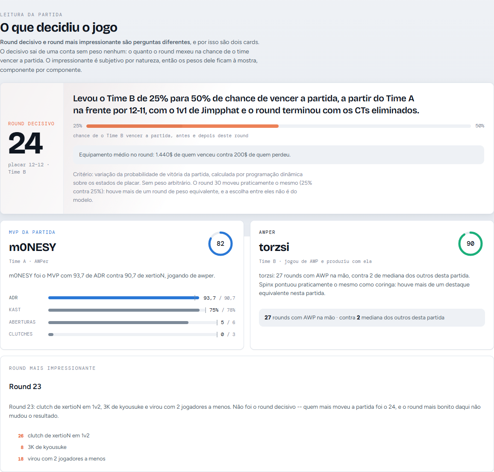
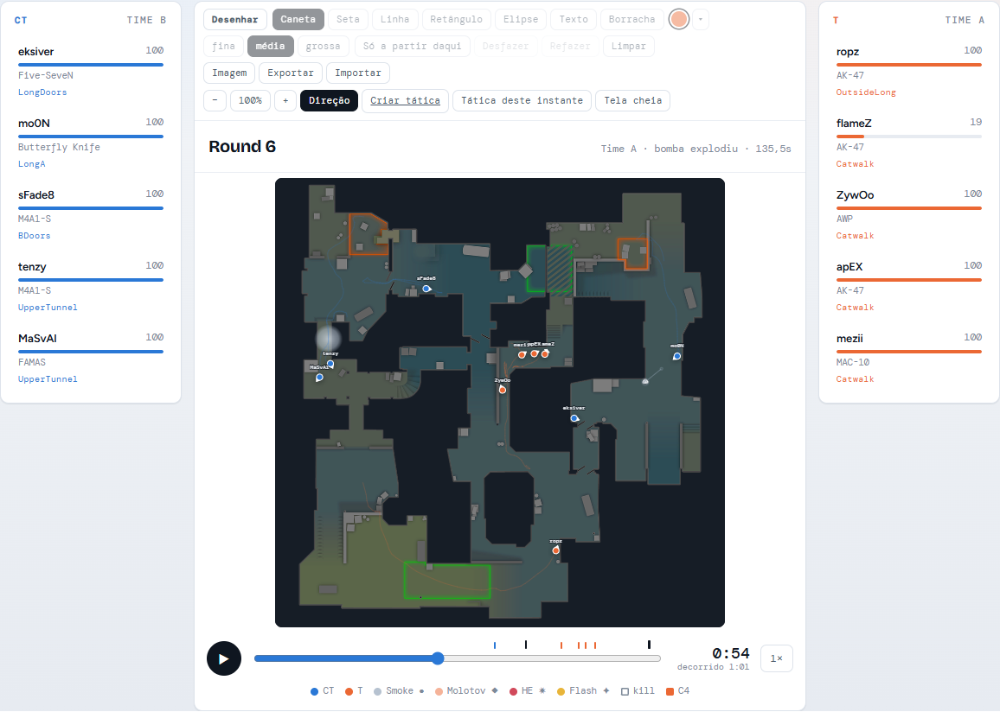
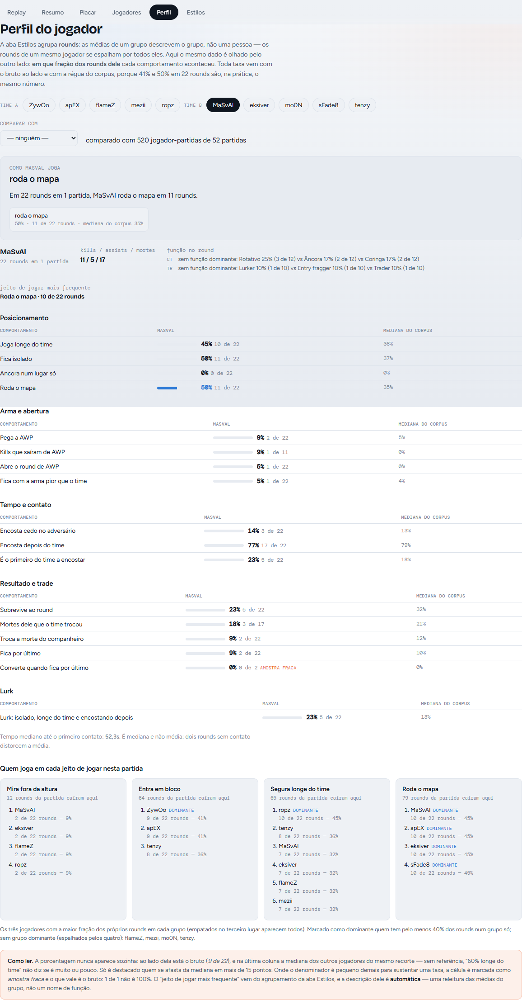
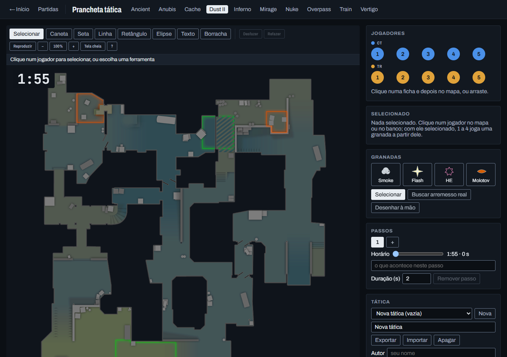

# Parser de Replay CS2

[](https://github.com/pedroppansani/parser-replay-cs2/actions/workflows/pages.yml)

Lê replays `.dem` do Counter-Strike 2 e gera um site estático por partida: replay
no radar, leitura da partida, perfil de cada jogador e uma prancheta tática com
arremessos reais. O parsing é da biblioteca [awpy](https://awpy.rtfd.io/); o
trabalho daqui é o desenho das métricas, cada uma com a decisão de jogo escrita
no código e conferida contra dado oficial.

**[Ver o site](https://pedroppansani.github.io/parser-replay-cs2/)** · <!-- numeros:inicio corpus -->52 partidas (43 profissionais, de 9 times, e 9 de FACEIT) em 8 mapas<!-- numeros:fim corpus -->.

## Três números

<!-- numeros:inicio resumo -->
- **410 de 410** placares idênticos aos da HLTV. Kills e mortes de 410 jogadores em 41 mapas profissionais batem com o placar oficial, um a um.
- **0,079** erro médio do rating contra o oficial. Em 430 jogador-partidas (correlação 0,966), deixando uma partida fora a cada vez. É uma implementação própria da metodologia publicada, não o número da HLTV.
- **100%** botão do arremesso certo, fora da amostra. A força de 6.846 granadas inferida só da posição, conferida contra o que a demo grava em 13 partidas.
<!-- numeros:fim resumo -->









## Como sei que os números estão certos

**A escada contra a HLTV.** Cada contagem é conferida contra o que a HLTV
publica por jogador, de baixo para cima: se kills e mortes não baterem, qualquer
acerto do rating em cima delas seria coincidência.

<!-- numeros:inicio validacao -->
| O que é conferido | Resultado |
|---|---|
| Kills e mortes por jogador | 410 de 410 idênticos (41 mapas) |
| ADR | 401 de 410 idênticos no arredondamento |
| KAST | 247 de 330 idênticos |
| Aberturas, rounds de multi-kill e headshots | 80 de 80 idênticos (8 séries inteiras) |
| Clutches vencidos | 67 de 80 idênticos |
| Rating, na página (dentro da amostra) | erro médio 0,077, correlação 0,967 (430 jogador-partidas) |
| Rating, fora da amostra | erro médio 0,079, correlação 0,966 |
| Convenção de ângulos | mira a 1,68° da vítima no tick da kill, contra 6,00° na convenção invertida (7.652 kills) |
<!-- numeros:fim validacao -->

**O rating, dito com honestidade.** É uma implementação própria da metodologia
publicada do [Rating 3.0](https://www.hltv.org/news/41283/introducing-rating-30);
os coeficientes da HLTV são fechados, então este não é o número oficial. O
número "fora da amostra" acima deixa uma partida de fora a cada vez, mas hoje
reajusta **só os pesos** dos componentes: o modelo de chance de round, a
referência de escala e a tabela de economia foram estimados com todas as
partidas, inclusive a avaliada. É um limite conhecido da validação, não um
detalhe.

**Os arremessos.** A demo grava o botão de cada granada (curto, médio, longo), se
o jogador estava no ar e se estava agachado, mas só quem tem o `.dem` consegue
ler isso. O projeto mediu a rotina de arremesso do jogo num gabarito de demos e
passou a **inferir** os três só com a posição dos jogadores e do projétil, que é
o que resta quando a demo já foi apagada. A inferência é conferida contra o
gabarito dentro e fora da amostra (fora: as constantes são recalculadas sem a
partida avaliada), e onde ela não sustenta uma afirmação o arremesso fica sem
rótulo em vez de receber um palpite.

<!-- numeros:inicio arremessos -->
| Arremessos (13 demos, 6.846 granadas) | Dentro da amostra | Fora da amostra |
|---|---|---|
| Botão (curto, médio, longo), por partida | 100% | 100% |
| No ar ou no chão, por partida | 99,7% a 100% | 99,7% a 100% |
| Em pé ou agachado, por partida | 100% | 99,7% a 100% |
| Arremessos com botão afirmado | 97,6% | 97,7% |
<!-- numeros:fim arremessos -->

Nas partidas que têm o `.dem`, o valor lido da demo substitui o inferido, e cada
campo diz de onde veio. A comparação entre os dois roda como teste permanente.

## A prancheta tática

Uma página por mapa para montar jogadas: peças, passos, granadas e desenho livre,
com reprodução animada.

- **Arremessos reais.** Clique onde a granada deve cair e a prancheta lista os
  arremessos do corpus que caem ali, com posição, ângulo, botão, postura e o
  comando de console (`setpos` e `setang`) que leva até lá.
- **Tática deste instante.** No replay de qualquer partida, um botão abre a
  prancheta com os jogadores vivos daquele quadro, na posição e na direção em
  que estavam, e as granadas ativas ligadas ao arremesso que as gerou.
- **Pronta para mais de uma pessoa.** A tática é um log de operações: duas cópias
  editadas em separado se juntam sem conflito, e desfazer nunca apaga histórico.

## Como rodar

Python 3.11 a 3.13 (o awpy 2.0.2 não suporta 3.14). No Windows, `py -3.12`.

```bash
pip install -r requirements.txt

# radares oficiais, extraídos da instalação local do CS2 (uma vez só)
python -m scripts.extract_radars

# processar as demos da pasta demos/ (parse, métricas, replay, página)
python -m scripts.process_all_demos

# gerar o site com todas as partidas processadas, em docs/index.html
python -m scripts.build_site

# testes (os de navegador usam o Chrome via Playwright; sem ele, são pulados)
python -m pytest tests/
```

Uma demo só: `python -m scripts.process_demo caminho/da/partida.dem --match-id match_99`.
São <!-- numeros:inicio testes -->1.114 testes<!-- numeros:fim testes -->, e o CI
roda a suíte antes de publicar o site.

## Limitações

- **Corpus concentrado.** Quase todas as partidas profissionais são de poucos
  times de topo. O rating ainda não foi avaliado em partidas de times fora do
  corpus.
- **Rating.** Implementação própria, validada como descrito acima. O modelo de
  chance de round usa poucas entradas (vantagem numérica, equipamento, bomba e
  lado).
- **Estilo de jogo é contínuo.** O agrupamento de estilos tem separação fraca e
  não melhorou com volume: os grupos descrevem, não classificam.
- **Probabilidade de vitória** supõe rounds independentes; economia e momentum
  violam isso.
- **Comando de console dos arremessos** ainda não foi conferido dentro do jogo.
  Até lá, a página avisa em cada ficha.
- **KAST e clutch** não batem em todos os jogadores: a HLTV aplica regras que os
  dados publicados não permitem recuperar.

## Notas técnicas

O histórico de cada métrica, com as versões testadas e descartadas, está em
[`notas/`](notas/). As decisões em vigor estão resumidas em [`CLAUDE.md`](CLAUDE.md).
